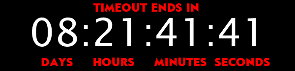

<div align="center">

# PHP EMAIL TIMER


<br>


  
</div>

---


This library generates an animated GIF that visualizes a live countdown to a target date/time.
Each frame represents one second, up to a configurable maximum.
<br><br>
It is based on the original project by goors/php-gif-countdown, extended with improved rendering, validation, cache and configuration options.
<br><br><br><br>

## Features

- Generates a second-by-second animated GIF countdown
- Customizable background image, font, size, and offsets
- Anti-aliased text rendering with alpha preservation
- Fully timezone-aware countdown calculation
- Zero-padding and formatting for multi-day countdowns
- Optional filesystem-based caching to reduce server load

---

## Requirements

* **PHP 7.4+**
* **GD Extension** with TrueType font support
* A PNG base image (`base.png`)
* A TrueType font file (`font.ttf`)

---

## Installation

Clone the repository:

```bash
git clone https://github.com/<your-username>/<your-repo>.git
cd <your-repo>
```

Ensure the following files exist in the repository root:

```
base.png
font.ttf
AnimatedGif.php
CacheManager.php
index.php
```

Make sure your server has the GD extension enabled:

```bash
php -m | grep gd
```

If not present, enable it in your PHP configuration.

---

## Usage

### Basic HTTP Call

The script exposes a GIF endpoint that can be included directly in HTML `` tags.

Example:

```html

```

### Required GET Parameters

| Parameter | Description                                               |
| --------- | --------------------------------------------------------- |
| `time`    | A timestamp or any date string supported by `strtotime()` |

### Example With URL Encoding

```html

```

### Countdown Display Format

The countdown text appears as:

```
DD:HH:MM:SS
```

Example with more than 9 days:

```
12:03:45:01
```

If the target date is reached or passed, the GIF displays:

```
00:00:00:00
```

…and stops at that frame.

---

## Configuration

Editable constants are defined near the top of the script:

```php
const BASE_IMAGE_PATH = __DIR__ . '/base.png';
const FONT_PATH       = __DIR__ . '/font.ttf';
const FONT_SIZE       = 60;
const FONT_COLOR_RGB  = ["r"=>255, "g"=>255, "b"=>255];
const FONT_X_OFFSET   = 60;
const FONT_Y_OFFSET   = 95;
const FRAME_DELAY     = 100; // centiseconds (100 = 1s)
const MAX_FRAMES      = 60;  // total GIF frames
const TIME_ZONE       = 'Europe/Rome';
```

### What You Can Customize

* Background image
* Font file and size
* Text color (RGB)
* Text positioning (X/Y offsets)
* Frame delay
* Maximum frames
* Timezone

---

## 🗄️ Caching System (Optional)

The library includes a lightweight caching layer that prevents excessive regeneration of the GIF countdown.

### Why Caching?

Generating a GIF frame-by-frame is CPU-intensive.  
If many clients request the same countdown (e.g., in emails), the server might regenerate identical animations multiple times per second.

The caching system ensures:

- **At most one GIF is generated every 60 seconds** per unique `time` parameter  
- Subsequent requests within that minute are served instantly from disk  
- Server CPU usage is drastically reduced  

### How It Works

Each request is keyed using the `time` parameter:

```
countdown_<md5($time)>.gif
```

The generated GIF is stored in the `cache/` directory.

For the next 60 seconds:

- If the cached GIF exists and is fresh → it is returned immediately  
- If the cache is expired or missing → a new GIF is generated and stored  

### Enabling the Cache

The caching layer is automatically active if the following file exists:

```
CacheManager.php
```

and the `cache/` directory is writable.

No configuration is required.

### Cache Lifetime

The default TTL is **60 seconds**.  
You may change it in the script where `CacheManager` is initialized:

```php
$cache = new CacheManager(__DIR__ . '/cache', $cacheKey, 60);
```

---

## Integration Examples

### 1. Embedding in a Website

```html
<p>Event Countdown:</p>

```

### 2. Dynamic Email (as long as your server allows external GIFs)

```html

```

### 3. Display in a Dashboard or Admin Panel

```php
echo '';
```

---

## Security Considerations

* Ensure access to this script is rate-limited if used publicly.

---

## Error Handling

The script returns meaningful HTTP status codes:

| Code    | Meaning                                                            |
| ------- | ------------------------------------------------------------------ |
| **400** | Invalid date format                                                |
| **403** | Missing `time` parameter                                           |
| **500** | Missing files, corrupted base image or font, GIF generation errors |

---

## Contributing

Pull requests are welcome!
Areas that might benefit from improvement:

* Variable GIF dimensions
* Multiple themes or color schemes
* Support for transparency-based rendering
* Composer packaging

---

## Changelog

### v1.0
- Added filesystem-based caching layer (1 GIF/minute per timestamp)
- Added CacheManager class
- Updated README with new documentation
- Improved overall formatting and badges

### v0.5
- Major refactor and cleanup
- Improved rendering quality
- Better error handling
- Full timezone support

### v0.1
- Forked from goors/php-gif-countdown

---

## License

Distributed under the MIT License.
See `LICENSE` for details.

---
Forked and updated from https://github.com/goors/php-gif-countdown

